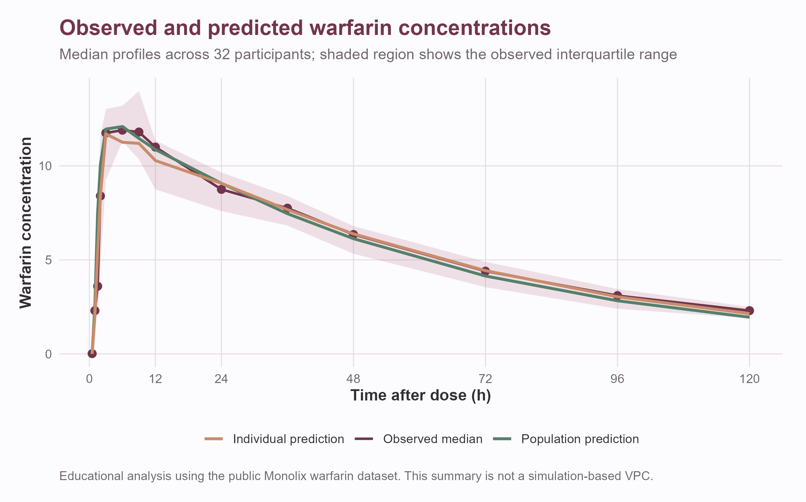
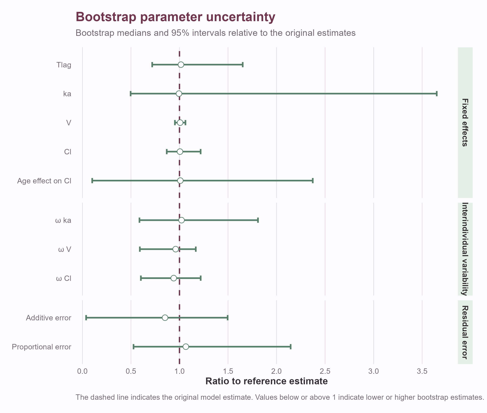
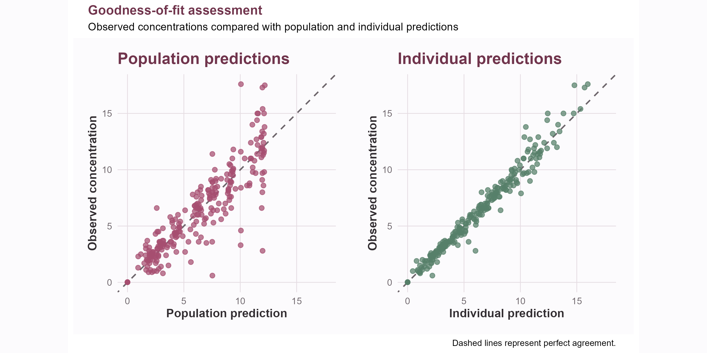
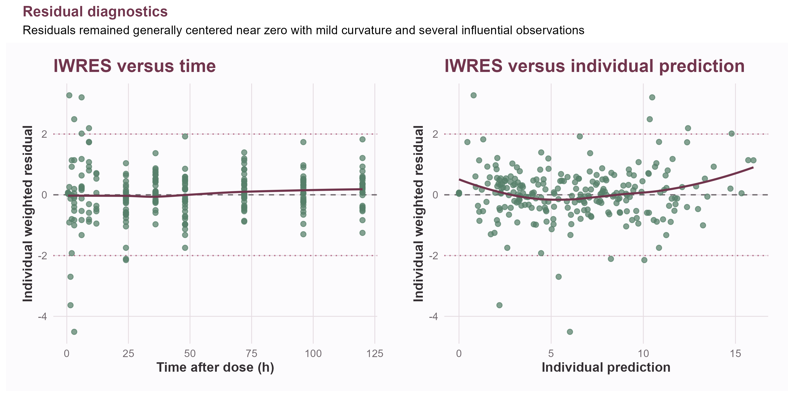

::: {.callout-note}
## Educational scope

This is an independent educational case study developed to build practical
experience in population pharmacokinetic modeling with Monolix and R.

The analysis was not designed for clinical decision-making, dose selection,
regulatory use, or publication. Results should therefore be interpreted as a
demonstration of model-development reasoning rather than as a new clinical
model of warfarin.
:::

## Project overview

I used a publicly available warfarin pharmacokinetic dataset to develop and
evaluate a population PK model through a stepwise nonlinear mixed-effects
modeling workflow.

The project focused on learning how structural, statistical, and covariate
modeling decisions interact. Rather than selecting a model solely from its
objective function, I evaluated convergence, parameter precision, diagnostic
plots, biological plausibility, and bootstrap stability.

The final model was a parsimonious one-compartment model with delayed
first-order absorption, linear elimination, a combined residual-error model,
fixed allometric effects of body weight, and an estimated effect of age on
clearance.

## Dataset

The dataset contains single-dose warfarin pharmacokinetic observations from
**32 healthy volunteers**, with **251 plasma concentration measurements**.

Available subject characteristics included:

- body weight;
- age;
- sex;
- administered dose;
- sampling time;
- plasma warfarin concentration.

The study included measurements extending from the absorption phase through
120 hours after administration. Sampling intensity varied between individuals,
creating both richly sampled and relatively sparse concentration-time profiles.

{fig-alt="Median observed warfarin concentrations and population and individual model predictions from zero to 120 hours after dosing." width="100%"}

The dataset is distributed as an educational example with MonolixSuite and was
originally derived from clinical studies by O'Reilly and colleagues.

[Access the Monolix warfarin dataset](https://monolixsuite.slp-software.com/monolix/2024R1/warfarin-data-set){.btn .btn-primary}

## Educational objectives

The main objectives were to gain practical experience with:

- exploratory analysis of longitudinal PK data;
- structural model selection;
- residual-error model selection;
- interindividual variability;
- covariate screening and model building;
- fixed allometric scaling;
- SAEM convergence assessment;
- goodness-of-fit diagnostics;
- visual predictive checks;
- random-effect and residual diagnostics;
- nonparametric bootstrap uncertainty analysis;
- recognizing overparameterization and weak identifiability.

## Model-development workflow

I evaluated 15 candidate models representing combinations of:

- one- and two-compartment disposition;
- delayed and non-delayed absorption;
- alternative residual-error models;
- different random-effect structures;
- weight and age covariate effects;
- estimated and fixed allometric relationships;
- alternative initial parameter values.

Model development was performed iteratively. Each modification was evaluated
using parameter estimates, relative standard errors, information criteria,
convergence traces, diagnostic plots, and biological interpretability.

## Structural-model investigation

A two-compartment model improved the likelihood-based criteria and produced
reasonable individual predictions. However, the apparent improvement was not
supported by adequate parameter stability.

In particular, intercompartmental clearance \(Q\) showed:

- a high relative standard error;
- strong sensitivity to initialization;
- an extremely broad and asymmetric bootstrap distribution;
- occasional implausibly large estimates in resampled datasets.

The bootstrap mean for \(Q\) was strongly influenced by extreme runs and was
substantially different from its median and reference estimate. This indicated
that the available sampling design did not reliably support estimation of the
additional distribution parameters.

For this reason, the two-compartment model was not retained despite its lower
objective function.

::: {.callout-tip}
## Modeling lesson

A more complex model can improve likelihood-based criteria while still being
poorly supported by the data. Parameter stability, identifiability, and
predictive behavior must be considered together with AIC, BIC, and the
objective function.
:::

## Final population PK model

The selected model consisted of:

- one disposition compartment;
- first-order absorption;
- an absorption lag time;
- linear elimination;
- lognormally distributed individual parameters;
- interindividual variability on \(k_a\), \(V\), and \(Cl\);
- fixed allometric effects of body weight;
- an estimated age effect on clearance;
- a combined additive and proportional residual-error model.

For individual \(i\), volume and clearance were represented as:

$$
V_i =
V_{\mathrm{pop}}
\left(\frac{WT_i}{70}\right)^1
\exp(\eta_{V,i})
$$

and

$$
Cl_i =
Cl_{\mathrm{pop}}
\left(\frac{WT_i}{70}\right)^{0.75}
\exp\left(\beta_{\mathrm{age}}\,
\frac{AGE_i-40}{10}\right)
\exp(\eta_{Cl,i}).
$$

The fixed exponents of 1 for volume and 0.75 for clearance reflect conventional
allometric scaling assumptions.

The combined residual-error model was:

$$
y_{ij} =
\hat y_{ij} +
\left(a+b\hat y_{ij}\right)\varepsilon_{ij},
\qquad
\varepsilon_{ij}\sim\mathcal N(0,1).
$$

## Final parameter estimates

| Parameter | Description | Estimate |
|---|---|---:|
| $Tlag_{\mathrm{pop}}$ | Absorption lag time | 0.828 h |
| $k_{a,\mathrm{pop}}$ | First-order absorption rate | 1.287 h$^{-1}$ |
| $V_{\mathrm{pop}}$ | Volume for a 70-kg individual | 8.026 L |
| $Cl_{\mathrm{pop}}$ | Clearance for a 40-year-old, 70-kg individual | 0.146 L/h |
| $\beta_{\mathrm{Cl,age}}$ | Age effect on clearance per decade | 0.095 |
| $\omega_{ka}$ | Random-effect SD for absorption | 0.948 |
| $\omega_V$ | Random-effect SD for volume | 0.141 |
| $\omega_{Cl}$ | Random-effect SD for clearance | 0.246 |
| $a$ | Additive-error parameter | 0.281 |
| $b$ | Proportional-error parameter | 0.0718 |

Within this dataset, the estimated age coefficient corresponds to an
approximately 10% increase in typical clearance per decade:

$$
\exp(0.095)\approx 1.10.
$$

This relationship should be treated as an exploratory dataset-specific result,
not as a clinical conclusion.

## Covariate assessment

Initial diagnostic analyses showed strong relationships between individual
volume estimates and body weight and a weaker relationship between clearance
and body weight.

Weight effects on volume and clearance were therefore represented through
fixed allometric scaling. This reduced the need to estimate poorly supported
covariate exponents while retaining a physiologically interpretable
relationship.

After accounting for weight, age remained associated with the clearance random
effect. An age effect was consequently evaluated and retained in the final
educational model.

Sex was investigated but was not retained after accounting for the available
continuous covariates.

## Bootstrap uncertainty analysis

A nonparametric bootstrap with **200 resampled datasets** was used to examine
parameter stability.

Selected bootstrap results were:

| Parameter | Reference | Bootstrap median | 95% interval |
|---|---:|---:|---:|
| $Tlag_{\mathrm{pop}}$ | 0.828 | 0.841 | 0.595–1.367 |
| $k_{a,\mathrm{pop}}$ | 1.287 | 1.280 | 0.639–4.697 |
| $V_{\mathrm{pop}}$ | 8.026 | 8.079 | 7.648–8.521 |
| $Cl_{\mathrm{pop}}$ | 0.146 | 0.147 | 0.127–0.178 |
| $\beta_{\mathrm{Cl,age}}$ | 0.095 | 0.096 | 0.010–0.226 |
| $\omega_{ka}$ | 0.948 | 0.968 | 0.557–1.715 |
| $\omega_V$ | 0.141 | 0.135 | 0.083–0.164 |
| $\omega_{Cl}$ | 0.246 | 0.231 | 0.148–0.300 |

{fig-alt="Forest plot showing bootstrap medians and 95 percent intervals relative to the original estimate for fixed effects, interindividual variability, and residual-error parameters." width="100%"}

Volume and clearance were estimated relatively consistently across bootstrap
samples. Absorption parameters and the age effect were more uncertain,
reflecting limited information about early absorption and the small number of
participants.

## Model diagnostics

Population and individual predictions generally captured the concentration-time
profiles, and individual predictions aligned closely with observed
concentrations.

{fig-alt="Goodness-of-fit plots comparing observed warfarin concentrations with population predictions and individual predictions." width="100%"}

The visual predictive check showed that the observed central tendency was
generally represented by the model and that most observations remained within
the simulated prediction interval.

However, the diagnostic analysis also identified limitations:

- several residual-distribution tests rejected normality;
- the clearance random effects departed from the assumed normal distribution;
- a small number of individuals had large standardized clearance effects;
- sparse or late-only sampling limited individual information for some subjects;
- absorption variability remained imprecisely estimated.

These findings were retained as part of the model evaluation rather than hidden
by selecting the most favorable diagnostics.

{fig-alt="Individual weighted residuals versus time and individual model predictions, with smooth trend lines and reference lines at zero and plus or minus two." width="100%"}

## Sampling-design investigation

Inspection of individuals with large standardized clearance effects showed that
these estimates were not explained by a single sampling category.

Both richly sampled and late-only participants contributed to the extremes.
This suggested that the observed behavior reflected a combination of genuine
individual profiles, residual variability, small-sample effects, and limited
information rather than a simple data-processing error.

The exercise reinforced the importance of evaluating individual parameter
estimates in the context of each subject's observation schedule.

## Key lessons

This project provided practical experience with several central principles of
population PK model development:

1. **Model complexity must be supported by the data.**  
   A lower objective function did not justify retaining an unstable
   two-compartment structure.

2. **Covariate selection requires multiple forms of evidence.**  
   Statistical tests, diagnostic plots, biological plausibility, uncertainty,
   and parameter stability were considered together.

3. **Bootstrap distributions can reveal weaknesses hidden by local standard
   errors.**  
   The instability of \(Q\) became especially clear through resampling.

4. **Good individual predictions are not sufficient evidence of model
   adequacy.**  
   Residual behavior, parameter distributions, predictive diagnostics, and
   uncertainty must also be examined.

5. **Transparent limitations strengthen an educational analysis.**  
   The final model is useful as a learning exercise while remaining subject to
   the limitations of a small historical dataset.

## Tools

Monolix
R
SAEM
PopPK
Bootstrap
Covariate modeling

## Data and scientific references

The dataset and original clinical context are available from the following
sources:

- [MonolixSuite: Warfarin dataset and downloadable data file](https://monolixsuite.slp-software.com/monolix/2024R1/warfarin-data-set)
- [O'Reilly and Aggeler (1968): Initiation of warfarin therapy without a loading dose](https://pubmed.ncbi.nlm.nih.gov/11712286/)
- [O'Reilly (1963): The pharmacodynamics of warfarin in man](https://pubmed.ncbi.nlm.nih.gov/14074349/)
- [Holford (1986): Clinical pharmacokinetics and pharmacodynamics of warfarin](https://pubmed.ncbi.nlm.nih.gov/3542339/)
- [Vuong, Verbeke, and Dreesen (2025): Warfarin PopPK case study and publicly available supporting data](https://doi.org/10.1002/psp4.70039)

## Reproducibility and use

This project uses public educational data and independently developed model
files and analysis scripts.

Any code shared with this case study is intended for demonstration and
reproducibility. It has not been validated for clinical, regulatory, or dosing
applications.